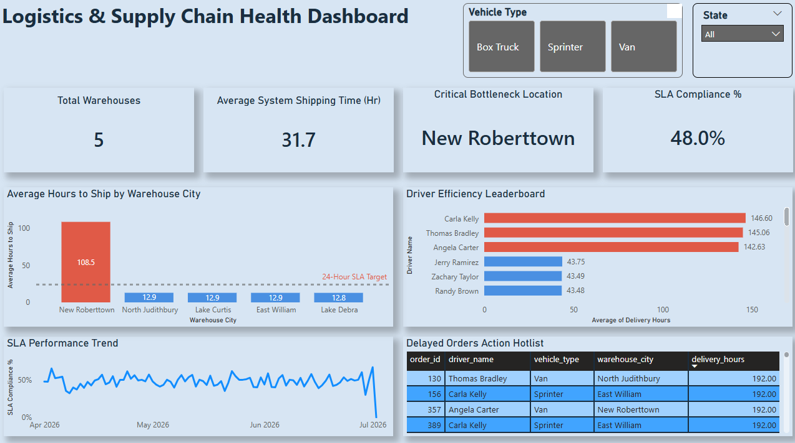
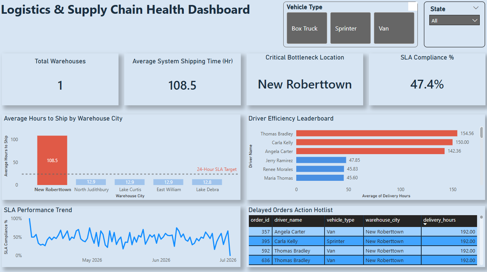

# 🚚 E-Commerce Logistics & Delivery Performance Analysis

## 📌 Executive Summary
This end-to-end data analytics project simulates and analyzes a 90-day e-commerce supply chain pipeline. The objective was to track orders from warehouse pick to final customer delivery, identify operational bottlenecks, and rank driver performance. 

By designing a custom data generation script in **Python**, querying transactional event logs in **PostgreSQL**, and building a star-schema model in **Power BI Developer Mode (`.pbip`)**, this project provides actionable operational insights to improve delivery SLA compliance.

---

## 🛠️ Tools & Technologies Used
* **Data Generation & Engineering:** Python (`pandas`, `faker`, `datetime`)
* **Database Management:** PostgreSQL
* **Data Querying & Analysis:** Advanced SQL (Common Table Expressions (CTEs), Window Functions, Date/Time Interval Extraction, Aggregations)
* **Data Visualization & Analytics:** Power BI saved in Developer Project format (`.pbip`)

---

## 📁 Repository Structure

```text
├── images/
│   ├── dashboard_global_view.png                    # Screenshot of overall Power BI report view
│   └── dashboard_roberttown_view.png                # Screenshot of filtered bottleneck view
├── logistics_performance_dashboard.Report/          # Power BI visual layouts & report pages
├── logistics_performance_dashboard.SemanticModel/   # DAX measures & data model
├── 01_dashboard_views.sql                           # Production SQL views feeding Power BI
├── 02_exploratory_analysis.sql                      # Deep-dive EDA & anomaly queries
├── README.md                                        # Repository documentation & summary
├── data_generation_script.py                        # Python simulation script
├── logistics_performance_dashboard.pdf              # PDF export of Power BI report
└── logistics_performance_dashboard.pbip             # Power BI Project main file
```
---

## 🗄️ Data Architecture & Data Pipline
To replicate real-world enterprise data challenges, a Python script was written four interconnected realational tables:
* **Warehouse:** Contains warehouse locations and operational capacities.
* **Drivers:** Contains driver details, assigned routes, and vehicle IDs.
* **Orders:** Primary entity tracking item details, order values, and timestamps.
* **Status_Events:** Granualar tracking table logging lifecycle events (`Picked`, `Shipped`, `Delivered`, `Delayed`).

---

## 🔍 Key SQL Analysis & Business Insights
### 1. Warehhouse Dispactch Bottlenecks
* **Query Technique:** Utilizing CTEs and PostgreSQL interval extraction ( `EXTRACT(EPOCH FROM...)`), elapsed time was calvualted between package `Picked` and `Shipped` status timestamps.
* **Key Finding:** The New Roberttown facility was identified as the primiary operational bottleneck, averaging significant dispatch delays well outside the company target window of under 24 hours.

### 2. Driver SLA & Delivery Performance Ranking
* **Query Technique:** Applied the `RANK()` Window Function across time deltas calculated betweeen `Shipped` and `Delivered` event records.
* **Key Finding:** Isolated bottom-perfomring delivery personnel who consitently faied to meet the required 2-day SLA delivery target.

---

## 📊 Interactive Dahsboard Highlighs
The power BI dashboard was engineered using a clean Star-Shema Model to enable dynamic cross-filtering:
* **Interactive Drill-Downs:** Selecting the *New Roberttown* warehouse dynamically filters driver lists, recalcualted SLA compliance percentages, and updates performnce trends.
* **SLA Target tracking:** Dynamic KPI cards highlight dispatch durations and overall compliance rates in real-time.

### Global Logistics Perfomrnce

*Figure 1: High-level overview tracking company SLA compliance, warehouse dispatch averages, and driver fulfillment rates.*

### Warehouse bottleneck Analysis (New Roberttown Deep-Dive)

*Figure 2: Dynamic cross-filtering isolating dispatch delays and driver performance specifically for the New Roberttown facility.*

---

## How to Replicate This Project
1. **Generate Data:**
   Run the Python script to build the raw relational dataset:
   **Bash**
   `python data_genration_script.py`
2. **Set Up PostgreSQL Datebase:**
   * Import genrated CSVs into PostgreSQL and execute `01_dashboard_views.sql` and `02_exploratory_analysis.sql` to sonctruct analytical views.
3. **Open Power BI Report:**
   * Open `Logistics_analysis.pbip` in Power BI Desktop (Ensure Developer Mode enabled) view and interact with the data model and deashboard layout.


**[View Full Power BI Dashboard (PDF)](./logistics_performance_dashboard.pdf)**
